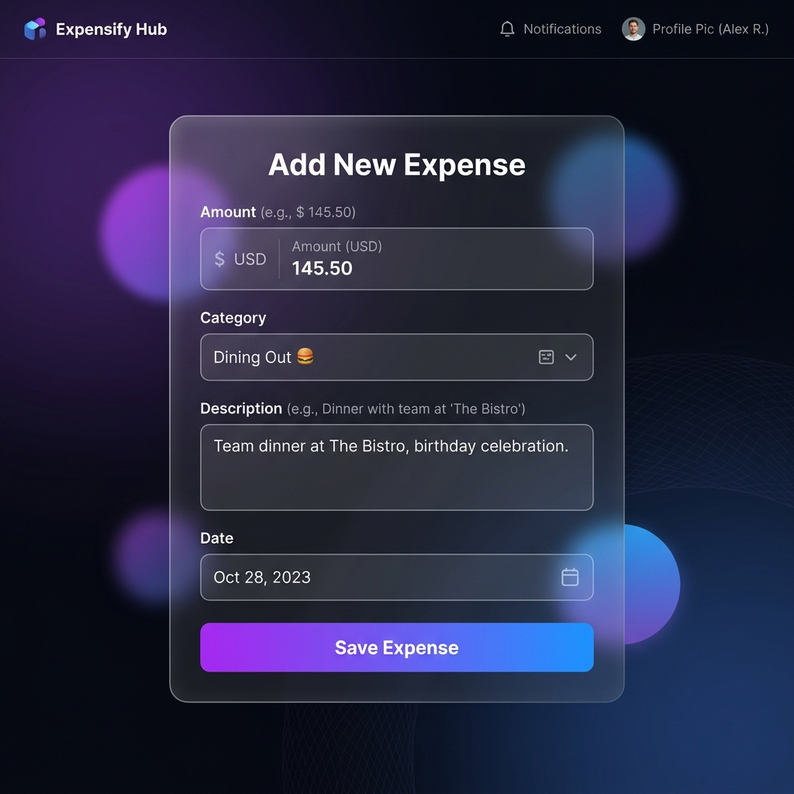
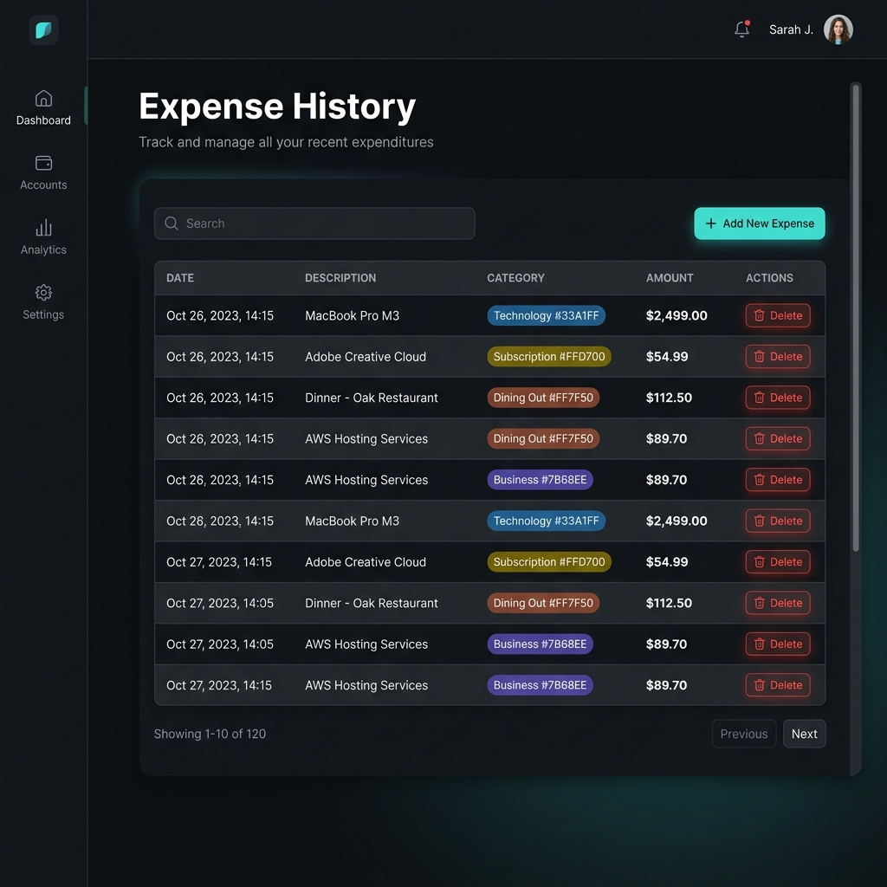

# 💸 Personal Expense Analyzer

A premium, Java-based web application for tracking daily expenses, built with **Spring MVC 6**, **Hibernate 6**, and **JSP**.

## 🚀 Overview
The **Personal Expense Analyzer** provides a sophisticated platform to record daily spending, visualize expense history, and gain financial insights. It leverages auto-categorization and intelligent saving suggestions to help you take control of your finances.

---

## 🛠 Features
- **✨ Seamless Add Expense**: Quick entry for amount, category, description, and date.
- **🏷 Smart Auto-Categorization**: Intelligently assigns categories based on keywords (e.g., "burger" -> **Food**, "fuel" -> **Travel**).
- **📋 Detailed History**: A clean, tabular view of all transactions with easy deletion.
- **📊 Financial Insights**:
    - Real-time monthly total calculation.
    - Category-wise spending breakdown.
    - AI-driven saving suggestions based on spending patterns.
- **🎨 Premium UI**: A modern, dark-themed interface with glassmorphism and smooth transitions.

---

## 📸 Screenshots

| Add Expense | View History | Financial Summary |
| :---: | :---: | :---: |
|  |  |  |

---

## 🛣 API Endpoints

The application exposes the following web endpoints managed by `ExpenseController`:

| Method | Endpoint | Description |
| :--- | :--- | :--- |
| `GET` | `/` | Home page (Redirects to `/add`) |
| `GET` | `/add` | Displays the form to add a new expense |
| `POST` | `/save` | Persists a new expense with auto-categorization logic |
| `GET` | `/view` | Displays the list of all recorded expenses |
| `GET` | `/delete/{id}` | Deletes a specific expense by its unique ID |
| `GET` | `/summary` | Displays monthly totals, category breakdown, and suggestions |

---

## 💻 Tech Stack
- **Backend**: Java 17+, Spring Framework 6 (MVC), Hibernate 6 (ORM).
- **Frontend**: JSP, HTML5, CSS3 (Vanilla).
- **Database**: MySQL 8.0.
- **Server**: Apache Tomcat 10+ (Jakarta EE).
- **Build Tool**: Maven.

---

## ⚙️ Installation & Setup

### 1. Prerequisites
- **JDK 17+**
- **Maven 3.8+**
- **MySQL 8.0**
- **Tomcat 10.x**

### 2. Database Initialization
Execute the schema script to set up your environment:
```sql
SOURCE db/schema.sql;
```

### 3. Configuration
Update your database credentials in `src/main/java/com/expense/config/AppConfig.java`:
```java
dataSource.setUsername("your_username");
dataSource.setPassword("your_password");
```

### 4. Build & Deploy
```bash
mvn clean package
```
Deploy the resulting `expense.war` from `target/` to your Tomcat `webapps/` directory.

---

## 📂 Project Structure
```text
PersonalExpenseAnalyzer/
├── src/main/java/com/expense/
│   ├── config/      # System & persistence configuration
│   ├── controller/  # Request mapping and business orchestration
│   ├── dao/         # Data access layer (Hibernate)
│   └── model/       # Domain entities (Expense)
├── src/main/webapp/
│   ├── WEB-INF/views/ # Dynamic JSP templates
│   └── static/css/    # Modern stylesheets
├── screenshots/     # Application previews
├── db/              # SQL schema scripts
└── pom.xml          # Dependency management
```

---

## 📜 License
Developed for academic excellence and personal financial tracking.
